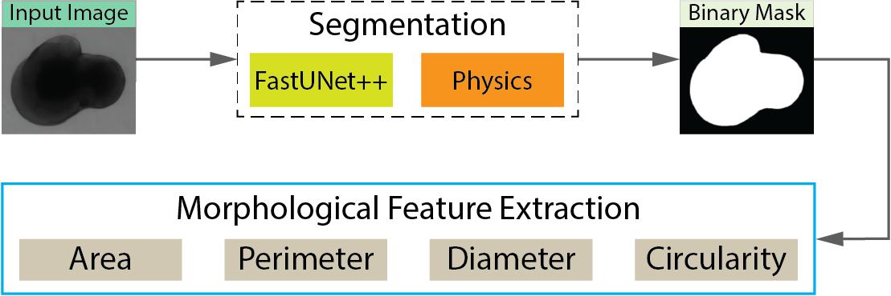
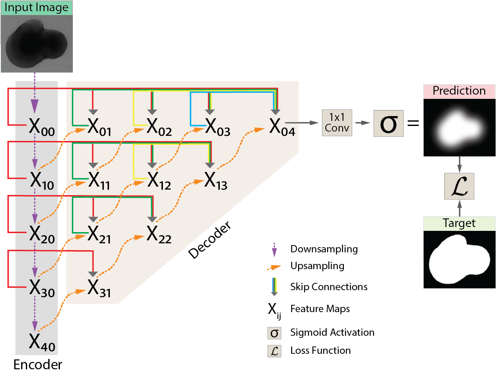
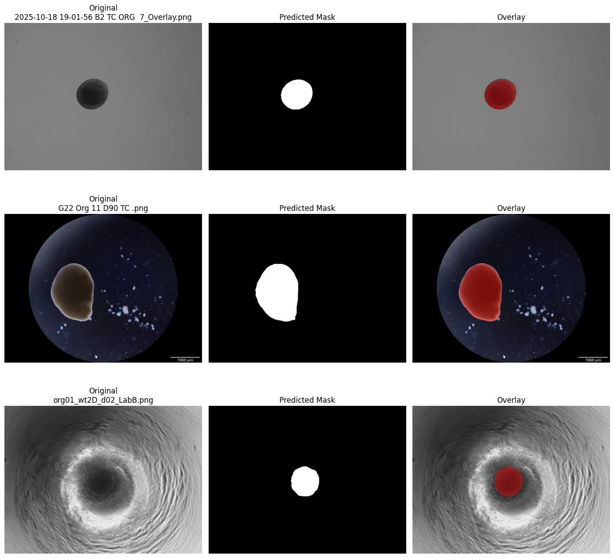
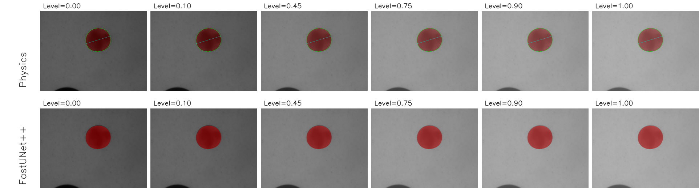
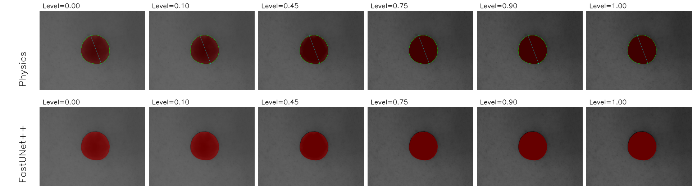

# Brain Organoid Analyzer

## Automated and Reproducible Morphometric Analysis of Brain Organoid Brightfield Images

This repository provides a graphical application for automated
segmentation and quantitative morphometric analysis of brain organoid
brightfield images. The framework combines FastUNet++, an efficient
UNet++-based segmentation model, with a handcrafted deterministic physics-based
segmentation method. The resulting binary masks are used to calculate
calibrated morphological measurements including area, perimeter, maximum
diameter, and circularity.

<!-- ------------------------------------------------------------------------ -->

# Quick Start

## Windows Application

Windows users can run the compiled application directly:

``` text
OrganoidAnalyzer.exe
```

The executable provides the graphical interface without requiring the
user to run the Python source code.

## Running from Source

Install the required dependencies:

``` bash
pip install -r requirements.txt
```

Then launch the application:

``` bash
python gui_app.py
```

<!-- ------------------------------------------------------------------------ -->

# Repository Structure

```text
FastUNet++/
│
├── data/                                   # Download separately
│   ├── annotate_b0/                        # Microscope 1 Batch 1
│   ├── annotate_b1/                        # Microscope 2
│   ├── annotate_b2/                        # Microscope 1 Batch 2
│   └── data_paper/                         # Dataset from Schröter et al.
│
├── figures/                                # Experimental visualizations
│   ├── FastUNet++-03.png                   # FastUNet++ architecture
│   ├── overview-02.png                     # Complete analysis framework
│   ├── physics_vs_fastunetpp_brightness.png
│   ├── physics_vs_fastunetpp_contrast.png
│   ├── physics_vs_fastunetpp_downsample.png
│   ├── physics_vs_fastunetpp_gaussian_noise.png
│   └── visual_results.png                  # Example segmentation results
│
├── models/                                 # Download separately
│   ├── best_unetpp_512x384.pt              # Trained FastUNet++ model
│   └── sam2_t.pt                           # SAM 2 model
│
├── .gitignore
├── gui_app.py                              # Main graphical analysis application
├── LICENSE
├── OrganoidAnalyzer.exe                    # Compiled Windows application
├── README.md
├── requirements.txt                        # Python dependencies
└── unetpp.py                               # FastUNet++ model definition
```

The `data/` and `models/` contents can be downloaded separately using the links below:

- **Data:** [Download data](https://hbkuedu-my.sharepoint.com/:f:/g/personal/absh58838_hbku_edu_qa/IgBkZ_TOnzCOQ4LFKGkPJ541AZCq7XQOOARgyDoiV1pb8pM?e=kIXcOl)
- **Models:** [Download models](https://hbkuedu-my.sharepoint.com/:f:/g/personal/absh58838_hbku_edu_qa/IgBgES48shqwS7kkkUeUtKtaAb580JupgKsnkjn5fH2qEYM?e=6NNFln)


<!-- ------------------------------------------------------------------------ -->

# Analysis Framework



The framework accepts brain organoid brightfield images and provides two
segmentation pathways:

-   **FastUNet++** for learned image segmentation.
-   **Handcrafted Physics-based segmentation** for deterministic image analysis.

Both methods produce a binary organoid mask that is passed to the same
morphometric analysis stage. This common measurement pipeline enables
consistent calculation of organoid morphology regardless of the selected
segmentation method. The extracted features include Area, Perimeter, Maximum diameter, and Circularity. The GUI also supports calibrated measurements, batch image processing,
visualization, manual mask refinement, and structured result export.

<!-- ------------------------------------------------------------------------ -->

# FastUNet++



FastUNet++ is an efficient modification of UNet++ designed for brain
organoid segmentation from brightfield images. It retains the nested
skip-connection structure of UNet++ while using a reduced channel
configuration and bilinear upsampling for efficient inference.
For an input image, the network generates a pixel-wise prediction that
is converted into a binary organoid mask. The architecture uses an
encoder-decoder structure with nested feature fusion, followed by a 1 x
1 convolution and sigmoid activation to obtain the final segmentation
probability map. The default model configuration used by the application is:

``` text
Input channels:       3
Output channels:      1
Base channels:        32
Input resolution:     512 x 384
```

<!-- ------------------------------------------------------------------------ -->

# Handcrafted Physics-Based Segmentation

The physics-based pathway provides a deterministic alternative to
learned segmentation. It identifies the organoid using image intensity
and foreground-background characteristics, followed by mask refinement
and morphological processing. This method does not require model inference and is particularly useful
as a complementary segmentation pathway when image characteristics
differ from those represented during neural-network training.
Both FastUNet++ and the physics-based method feed into the same
downstream morphometric measurement procedure.

<!-- ------------------------------------------------------------------------ -->

# Morphometric Analysis

After segmentation, the binary mask is used to quantify organoid
morphology.

The principal measurements are:

-   **Area** - the segmented organoid region.
-   **Perimeter** - the length of the organoid boundary.
-   **Maximum diameter** - the maximum Feret diameter across the
    segmented object.
-   **Circularity** - a shape descriptor calculated from area and
    perimeter.

When spatial calibration is available, pixel measurements can be
converted to physical units. This enables quantitative comparison of
organoid morphology across images and longitudinal experiments.

<!-- ------------------------------------------------------------------------ -->

# Segmentation Results



The figure shows representative images acquired under different imaging
conditions together with FastUNet++ predictions. Each example presents
the original brightfield image, predicted binary mask, and segmentation
overlay. These examples illustrate segmentation across images with substantial
differences in background appearance, illumination, field of view,
organoid morphology, and imaging system.

<!-- ------------------------------------------------------------------------ -->

# Robustness Evaluation

The segmentation methods were evaluated under controlled variations in
image brightness, contrast, spatial resolution, and Gaussian noise. The
figures below show representative outputs across increasing perturbation
levels.

## Brightness



Brightness perturbations evaluate the response of both segmentation
methods to changes in overall image intensity.

## Contrast



Contrast perturbations evaluate segmentation when the intensity
difference between the organoid and surrounding background is altered.

## Spatial Resolution


The downsampling experiment evaluates the effect of reduced spatial
resolution on organoid segmentation.

## Gaussian Noise


Gaussian-noise perturbations evaluate robustness to increasing image
noise. FastUNet++ performance can deteriorate at stronger noise levels,
while the deterministic physics-based method provides a complementary
analysis pathway under such conditions.

<!-- ------------------------------------------------------------------------ -->

# Graphical User Interface

The main application is implemented in `gui_app.py`. It integrates the
complete analysis workflow into a graphical interface so that
segmentation and morphometric measurements can be performed without
modifying the source code.

Core functions include:

-   Loading individual images or image batches
-   FastUNet++ segmentation
-   Physics-based segmentation
-   Optional segmentation refinement
-   Manual mask correction
-   Spatial calibration
-   Area, perimeter, diameter, and circularity measurement
-   Image and mask visualization
-   Batch processing
-   Structured result export

The Windows version is provided as `OrganoidAnalyzer.exe`.

<!-- ------------------------------------------------------------------------ -->


<!-- ------------------------------------------------------------------------ -->

# Citation

If you use this software, dataset, or trained models in your research,
please cite the associated paper:

``` bibtex
@article{shuaibu2026fastunetpp,
  title   = {Efficient Segmentation and Quantitative Morphometry of Brain Organoid Brightfield Images Using Learned and Handcrafted Methods},
  author  = {TBD},
  journal = {TBD},
  year    = {2026}
}
```

The citation information will be updated following publication.

<!-- ------------------------------------------------------------------------ -->

# License

This project is distributed under the MIT license.
